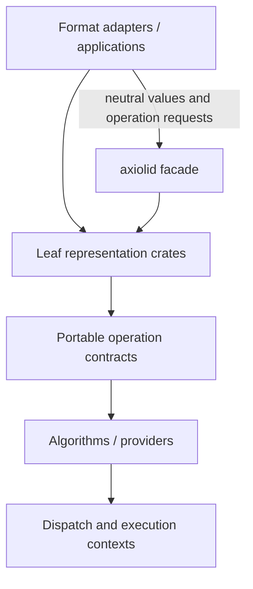

<p align="center">
  
</p>

<h1 align="center">Axiolid</h1>

<p align="center">
  <strong>A pure-Rust, format-agnostic geometry kernel.</strong><br>
  Neutral geometry data, explicit operation contracts, and replaceable execution providers.
</p>

<p align="center">
  <a href="https://axiolid.github.io/kernel/"></a>
  <a href="https://github.com/axiolid/kernel/actions/workflows/docs.yml"></a>
  <a href="LICENSE"></a>
  
</p>

> **Status: early kernel.** Axiolid has real, tested building blocks and strict architecture gates, but it is not yet a drop-in replacement for an established CAD kernel. The [capability page](https://axiolid.github.io/kernel/capabilities) separates implemented behavior from contracts and planned work.

## Why Axiolid?

Geometry infrastructure should not force an application into a source format, a native toolchain, one hardware API, or a monolithic dependency graph. Axiolid is a small, composable Rust workspace for applications that need a neutral geometry layer between imported data and execution.

- **Format-neutral:** no IFC, STEP, CAD, renderer, or GPU API vocabulary in the kernel model.
- **Pure Rust:** no C++ or OpenCascade dependency graph.
- **Pay for capability:** use a leaf crate, the small `axiolid` facade, or opt into algorithms and execution contexts deliberately.
- **Honest seams:** stable data and operation contracts are separate from providers; a provider advertises only what it implements.
- **Portable correctness first:** the reference package is the scalar oracle for optimized paths; CPU dispatch is runtime-selected, never `target-cpu=native`.

Read the [documentation site](https://axiolid.github.io/kernel/) for architecture, capability status, decisions, and contributor guidance.

## Quick start

Add the facade for core values, meshes, and the portable CPU shell:

```toml
[dependencies]
axiolid = { git = "https://github.com/axiolid/kernel.git" }
```

The always-available core vocabulary is deliberately small:

```rust
use axiolid::{Point3, Tolerance};

let origin = Point3::new(0.0, 0.0, 0.0);
let tolerance = Tolerance::METRE;

assert!(origin.is_finite());
assert!(tolerance.linear() >= 0.0);
```

For narrow dependency graphs, depend directly on leaf crates such as `axiolid-core`, `axiolid-mesh`, or `axiolid-reference`. Feature bundles are named for capability—not an input format:

```toml
axiolid = { git = "https://github.com/axiolid/kernel.git", features = ["discrete"] }
```

General NURBS algorithms are independently opt-in and also included in the
broader `parametric` bundle:

```toml
axiolid = { git = "https://github.com/axiolid/kernel.git", default-features = false, features = ["nurbs"] }
```

See [Getting started](https://axiolid.github.io/kernel/guide/getting-started) before selecting a bundle. Native consumers use the generated [`axiolid.h`](./crates/facade/axiolid-capi/include/axiolid.h) boundary through the stable `Axiolid::axiolid` [CMake source/package workflow](./docs/architecture/native-distribution.md); the [v0.4 ABI, ownership, refusal, and concurrency contract](./docs/architecture/c-abi-v0.4.md) is explicit.

## Architecture at a glance



The central invariant is a downward-only dependency graph: representation does not know source formats or execution APIs; adapters do not depend on concrete backends. See [Architecture](https://axiolid.github.io/kernel/architecture).

## What exists today

| Area | Current state |
| --- | --- |
| Core values, transforms, bounds, tolerance | Implemented |
| Mesh values, triangulation, and spatial primitives | Implemented in focused crates |
| Exact curve/surface/topology vocabulary | Represented behind opt-in features |
| General NURBS analysis and exact transformations | Implemented scalar reference algorithms behind `nurbs`; bounded projection is not a global-optimum certificate |
| Immutable geometry DAG | Implemented structural model |
| Scalar predicates and explicit mesh compilation | Implemented reference/oracle work |
| Focused exact B-rep extrusion compilation | Sharp filled/hollow rectangles and positive-axis filled circles retain analytic supports; unsupported exact families fail closed |
| Mesh Boolean provider | Optional provider; bounded to its declared mesh contract |
| CPU execution | Portable execution shell; SIMD/parallel capabilities are opt-in |
| GPU execution | Contract and adapter seam, not a bundled production GPU algorithm suite |

For precise limits and evidence, use the [capabilities page](https://axiolid.github.io/kernel/capabilities), not this summary.

## Development

```bash
cargo fmt --all -- --check
cargo test --workspace
cargo clippy --workspace --all-targets --all-features -- -D warnings
npm --prefix docs ci
npm --prefix docs run docs:build
```

The workspace also carries feature-isolation and mutation probes. See [Contributing](https://axiolid.github.io/kernel/guide/contributing) and [`AGENTS.md`](AGENTS.md) for project-specific checks.

## Project links

- [Documentation](https://axiolid.github.io/kernel/)
- [Architecture decisions](https://axiolid.github.io/kernel/adr/0009-layered-geometry-dag)
- [Geometry concepts and interactive models](https://axiolid.github.io/kernel/guide/geometry-concepts)
- [Capability status](https://axiolid.github.io/kernel/capabilities)
- [Roadmap](docs/ROADMAP.md)
- [Changelog](docs/CHANGELOG.md)
- [Sponsor Axiolid](https://github.com/sponsors/GeneralPawz)
- [Issue tracker](https://github.com/axiolid/kernel/issues)

## License

Axiolid is licensed under [Mozilla Public License 2.0](LICENSE). Separate application files may remain proprietary; see the [licensing guide](https://axiolid.github.io/kernel/guide/licensing).
